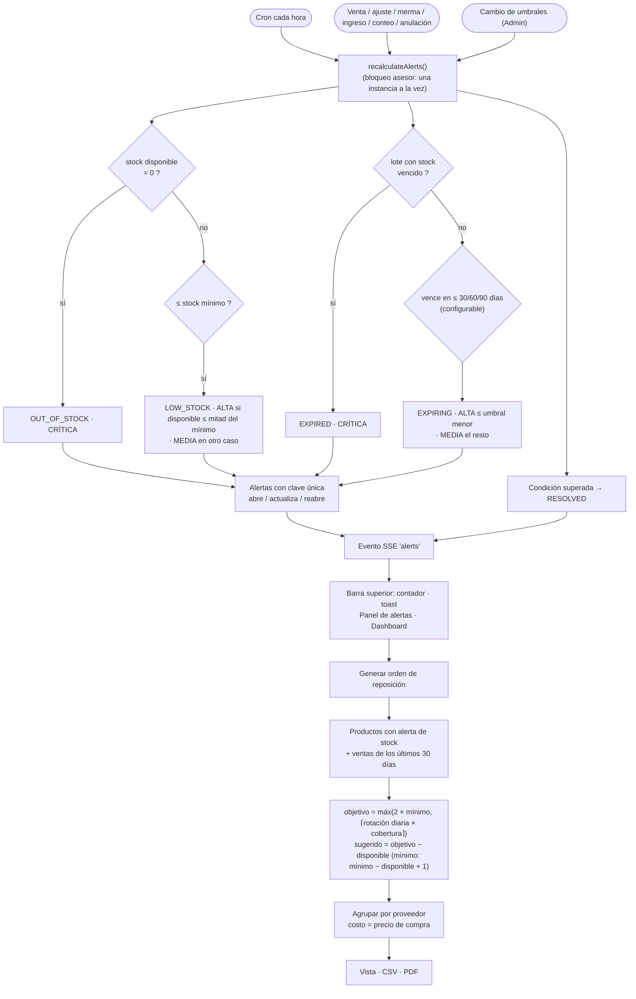

# Flujo de alertas y reposición

```mermaid
flowchart TD
  T1(["Cron cada hora"]) --> R
  T2(["Venta / ajuste / merma / ingreso / conteo / anulación"]) --> R
  T3(["Cambio de umbrales (Admin)"]) --> R
  R["recalculateAlerts()<br/>(bloqueo asesor: una instancia a la vez)"]

  R --> C1{"stock disponible<br/>= 0 ?"}
  C1 -- sí --> A1["OUT_OF_STOCK · CRÍTICA"]
  C1 -- no --> C2{"≤ stock mínimo ?"}
  C2 -- sí --> A2["LOW_STOCK · ALTA si disponible ≤ mitad del mínimo<br/>· MEDIA en otro caso"]
  R --> C3{"lote con stock<br/>vencido ?"}
  C3 -- sí --> A3["EXPIRED · CRÍTICA"]
  C3 -- no --> C4{"vence en ≤ 30/60/90 días<br/>(configurable)"}
  C4 --> A4["EXPIRING · ALTA ≤ umbral menor<br/>· MEDIA el resto"]

  A1 & A2 & A3 & A4 --> UP["Alertas con clave única<br/>abre / actualiza / reabre"]
  R --> RS["Condición superada → RESOLVED"]
  UP --> EV["Evento SSE 'alerts'"]
  RS --> EV
  EV --> UI["Barra superior: contador · toast<br/>Panel de alertas · Dashboard"]

  UI --> G["Generar orden de reposición"]
  G --> Q["Productos con alerta de stock<br/>+ ventas de los últimos 30 días"]
  Q --> F["objetivo = máx(2 × mínimo, ⌈rotación diaria × cobertura⌉)<br/>sugerido = objetivo − disponible (mínimo: mínimo − disponible + 1)"]
  F --> P["Agrupar por proveedor<br/>costo = precio de compra"]
  P --> X["Vista · CSV · PDF"]
```
